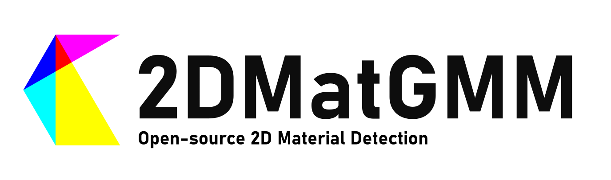

# 2DMatGMM-System



[](https://arxiv.org/abs/2306.14845) [](https://flakedemo.uslu.tech) [](LICENSE) [](https://doi.org/10.5281/zenodo.8042835) [](#Citing2DMatGMM)

Welcome to the 2DMatGMM-System repository. Herein lies the entire codebase for the 2DMatGMM detection system that has been implemented in our laboratory to manage and control hardware devices such as cameras, microscopes, and motor drivers. The main functionality of this system is to capture images and feed them to the detection algorithm. Once the images have been processed, they are saved, along with relevant metadata, in a dedicated Scan Folder. This data is subsequently uploaded to our web server for analysis, filtering, and downloading by human operators.

## Features

- **Arbitrary Wafer Shapes**: The System automatically detects the postion and shape of the wafer to only capture images of the wafer.
- **Online Detection**: The System can detect flakes in real-time and save the images and metadata to a Scan Folder without needing to first capture the entire wafer.
- **Multiple Magnifications**: The System captures images of detected flakes automatically at multiple magnifications to allow for a more detailed analysis later down the line.
- **Accurate Localisation**: To eliminate the need for human operators to manually mark the position of flakes, the System automatically generates a map of the wafer and marks the position of each flake.
- **Web Interface**: When used in conjuction with the [2DMatGMM-Website](https://github.com/Jaluus/2DMatGMM-Website) the System uploads the Scan Folder to a web server for analysis, filtering, and downloading by human operators.

## Repository Structure

The paper comprises three repositories each containing a part of the project:

- [2DMatGMM](https://github.com/Jaluus/2DMatGMM): The code for the machine learning model and the detection algorithm.
- [**2DMatGMM-System**](https://github.com/Jaluus/2DMatGMM-System): The full detection system used in the laboratory.
- [2DMatGMM-Website](https://github.com/Jaluus/2DMatGMM-Website): The code for the website to analyse, filter and download the flakes.

## Installation

To setup your Camera, Microscope and Motor Drivers follow the [installation instructions](INSTALL.md).

## Our Lab Hardware

| Hardware               | Manufacturer       | Model                                                                                                                                                                  |
| ---------------------- | ------------------ | ---------------------------------------------------------------------------------------------------------------------------------------------------------------------- |
| Scanning Table         | Märzhäuser         | [SCAN 100 x 100](https://www.marzhauser.com/en/pim/produktdetail-popup.html?view=details&pimid=a348&no_cache=1&m=null&p=null)                                          |
| Scanning Table Driver  | Märzhäuser         | [TANGO 2 Desktop](https://www.marzhauser.com/en/pim/produktdetail-popup.html?view=details&pimid=a182&no_cache=1&m=null&p=null)                                         |
| Microscope Controller  | Nikon              | [LV-ECON E](http://www.mvi-inc.com/wp-content/uploads/LV-ECON-E-Controller-Instruction-Manual-M374E2_3.pdf)                                                            |
| Microscope Z-Driver    | Nikon              | [LV-FMA](https://industry.nikon.com/en-gb/products/industrial-microscopy/industrial-microscopes/microscope-components/focusing-modules-base-arm-motorised-controller/) |
| Microscope Autofocus   | Nikon              | [LV-DAF](http://www.mvi-inc.com/wp-content/uploads/LV-DAF.pdf)                                                                                                         |
| Microscope Illuminator | Nikon              | [LV-UEPI2A](https://industry.nikon.com/en-us/products/industrial-microscopy/industrial-microscopes/microscope-components/compound-microscope-modular-components/)      |
| Camera                 | The Imaging Source | [DFK 33UX174](https://www.theimagingsource.com/de-de/product/industrial/33u/dfk33ux174/)                                                                               |

## <a name="Citing2DMatGMM"></a>Citing 2DMatGMM

If you use our work in your research or find the code helpful, we would appreciate a citation to the original paper:

```bibtex

@misc{uslu2023opensource,
      title={An open-source robust machine learning platform for real-time detection and classification of 2D material flakes},
      author={Jan-Lucas Uslu and Taoufiq Ouaj and David Tebbe and Alexey Nekrasov and Jo Henri Bertram and Marc Schütte and Kenji Watanabe and Takashi Taniguchi and Bernd Beschoten and Lutz Waldecker and Christoph Stampfer},
      year={2023},
      eprint={2306.14845},
      archivePrefix={arXiv},
      primaryClass={cond-mat.mes-hall}
}

```

## Contact

If you encounter any issues or have questions about the project, feel free to open an issue on our GitHub repository.
This Repo is currently maintained by [Jan-Lucas Uslu](mailto:jan-lucas.uslu@rwth-aachen.de).
